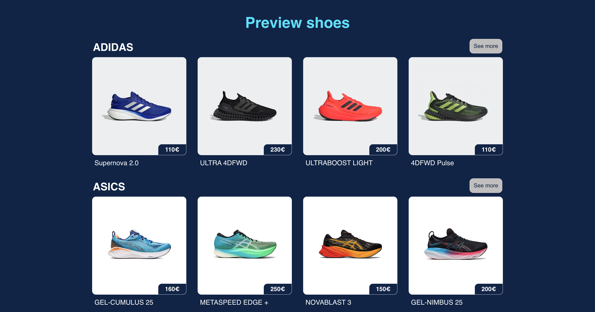

# FastFeetStore

FastFeetStore est un site de e-commerce créé avec React, Redux, SCSS, Firebase et Stripe. Il permet aux utilisateurs d'acheter des chaussures de course de différentes marques célèbres.

## Accès au site

Le site est actuellement hébergé sur [https://fastfeetstore.netlify.app/](https://fastfeetstore.netlify.app/).

## Fonctionnalités

- Parcourir et rechercher des chaussures de course de différentes marques.
- Ajouter des produits au panier.
- Effectuer le paiement et finaliser le processus en utilisant des cartes de test de Stripe.
- Authentification et inscription des utilisateurs à l'aide de Firebase.

## Test du paiement Stripe

Pour tester le système de paiement de Stripe, vous pouvez utiliser les détails de carte de test fournis par Stripe. Consultez la documentation de test de Stripe (https://stripe.com/docs/testing) pour plus d'informations sur les cartes de test disponibles et leur utilisation.

## Aperçu

